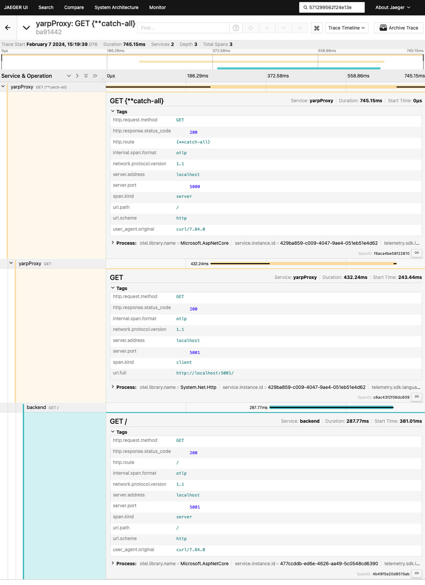

# Yarp simple distributed tracing sandbox

This is a simple use of YARP to experiment with instrumentation.

## Running

Start both services at the same time. By default, yarpProxy runs on port 5000, and forwards requests to the backendService on port 5001. Both are configured to send telemetry via OTLP to localhost.

[Run Jaeger All-In-One locally](https://www.jaegertracing.io/docs/1.22/getting-started/) to collect OTLP traces from both services.

Send a request to the yarnProxy service:

```bash
$ curl http://localhost:5000/ 
Hello World!%
```

Open the local Jaeger UI at http://localhost:16686 and look for traces from the yarnProxy and backendService.



